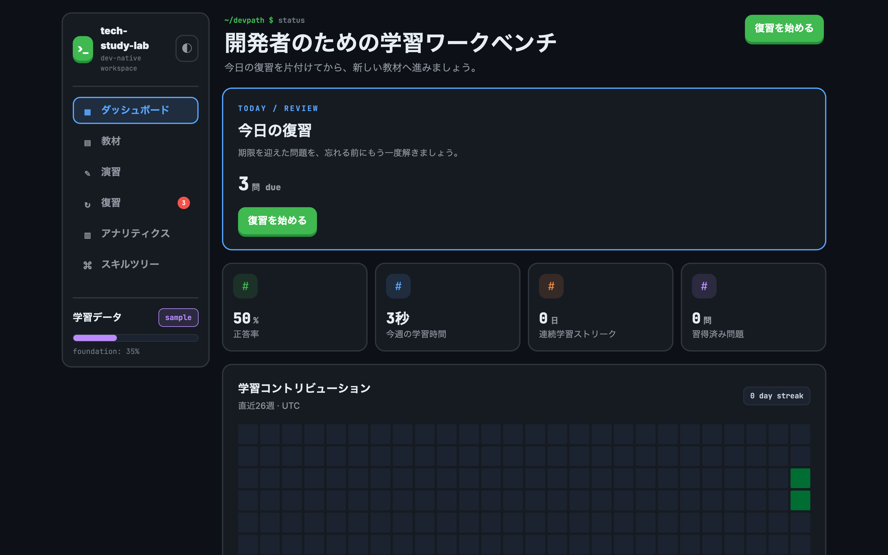
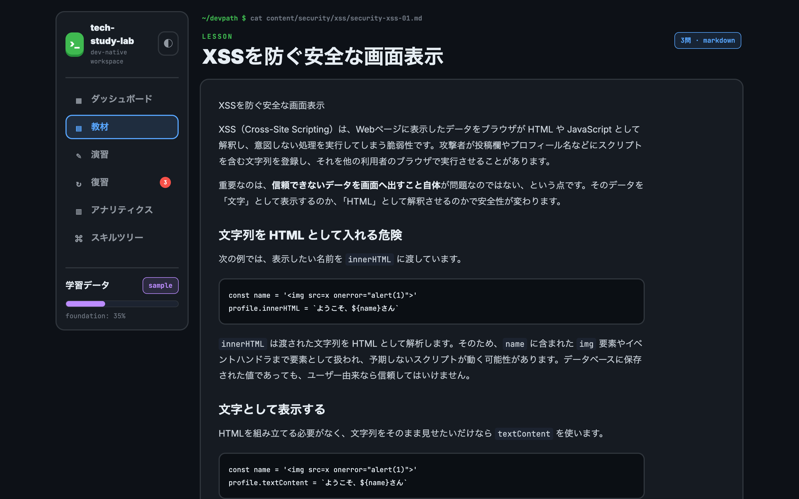
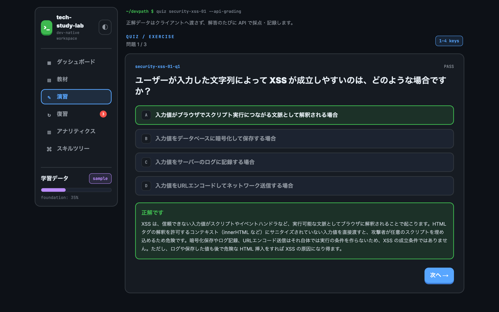
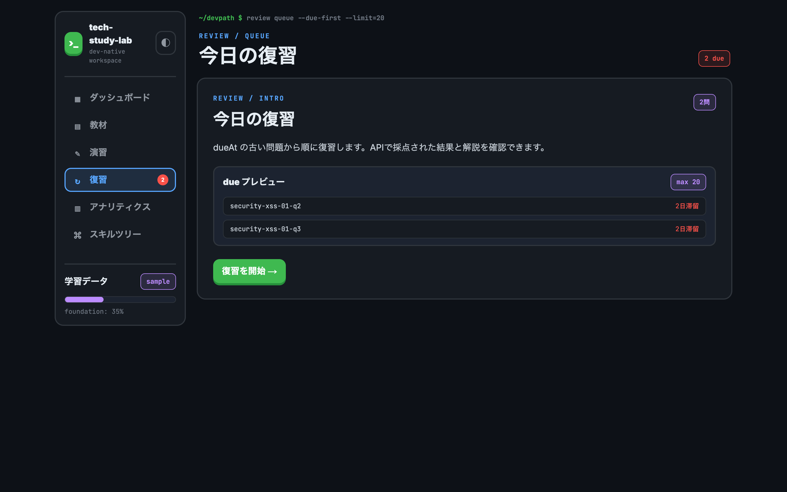
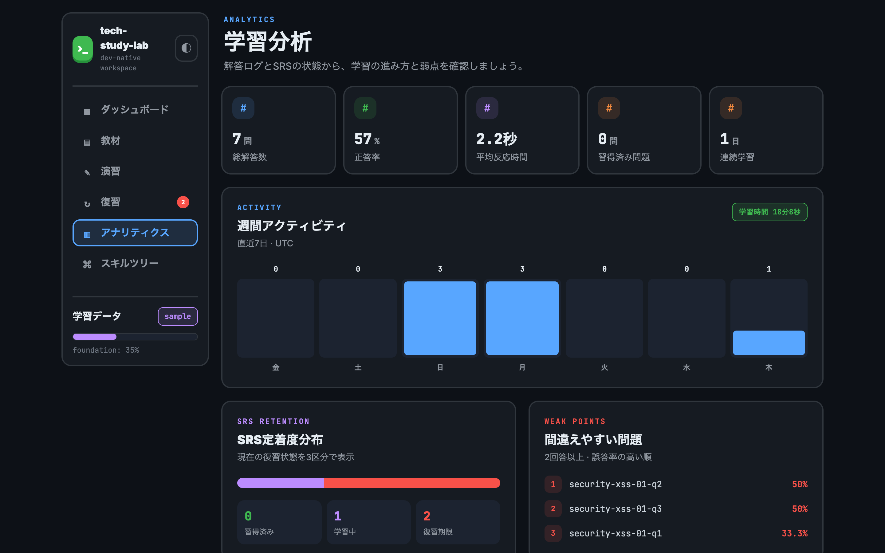
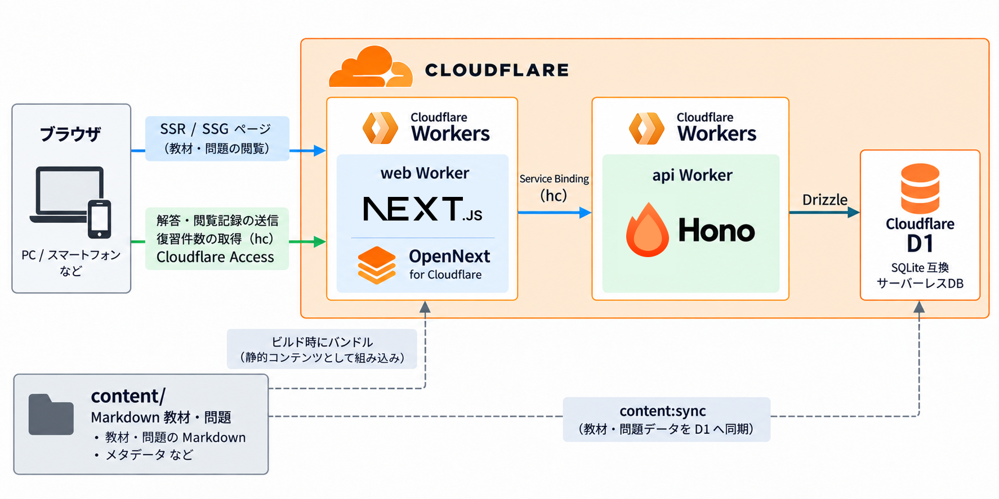
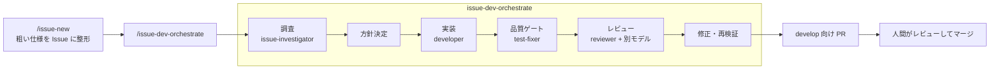

# tech-study-lab

個人エンジニア向けのソフトウェア学習アプリです。「セキュリティ / フロントエンド・バックエンドのフレームワーク / アーキテクチャ設計」を、**教材を読む → 4択で確かめる → SRS（間隔反復）で復習する**という流れで学べます。

このプロジェクトの一番の目的は、**AI コーディングエージェントに開発を任せられる基盤をつくること**です。アプリの機能と同じくらい、仕様・ガードレール・エージェント用ワークフローの設計に力を入れています。



## ハイライト

- **仕様駆動開発**：[`docs/design.md`](./docs/design.md) を仕様の正本とし、仕様変更は設計文書の更新から始めます。人間と AI が同じ基準で実装とレビューを行えます。
- **Issue からPRまでのエージェントパイプライン**：GitHub Issue を起点に「調査 → 方針決定 → 実装 → 品質ゲート → レビュー → 修正」を複数のサブエージェントが分担します。マージは必ず人間が判断します。
- **機械で守るガードレール**：TypeScript strict、Zod、Biome、dependency-cruiser による依存境界の検証、エージェント契約の検査をすべて CI の PR ゲートに入れています。
- **Knowledge Graph による影響範囲の特定**：コードと設定から構造グラフを抽出します。エージェントは全文検索の前にグラフで影響範囲を絞り込みます。
- **Claude Code と Codex の両対応**：スキル・エージェント定義・hooks を `.ai/` に一元化し、どちらのランタイムからも同じワークフローを使えます。
- **Cloudflare 構成**：Next.js（OpenNext）と Hono を別々の Worker としてデプロイし、Service Binding と型安全 RPC（`hc`）でつないでいます。

## 主な機能

| 画面 | 内容 |
| --- | --- |
| ダッシュボード（`/home`） | 今日の復習件数、正答率・学習時間・連続学習日数、学習ヒートマップ、領域別の習得状況 |
| スキルツリー（`/domains`） | 4つの学習領域ごとの習得率とトピックへの導線 |
| 教材（`/learn/...`） | Markdown で書いた教材本文。ビルド時に静的生成 |
| 演習（`/quiz/[lesson]`） | 4択問題を1問ずつ即時採点し、最後に結果をまとめて表示 |
| 復習（`/review`） | SM-2 アルゴリズムで期限が来た問題を、レッスンをまたいで出題 |
| アナリティクス（`/analytics`） | 週次アクティビティ、SRS 定着度の分布、間違えやすい問題のランキング |

SRS は問題単位で管理しており、弱点を1問ごとに追跡できます。

### スクリーンショット

| 教材 | 演習（API で即時採点） |
| --- | --- |
|  |  |
| **復習キュー** | **学習分析** |
|  |  |

画面はローカル環境で、開発用のサンプルデータを使って撮影しています。

## 技術スタック

| レイヤー | 技術 |
| --- | --- |
| フロントエンド | Next.js（App Router）/ Tailwind CSS / OpenNext for Cloudflare |
| API | Hono（Cloudflare Workers） |
| データベース | Cloudflare D1（SQLite）/ Drizzle ORM |
| 型・バリデーション | TypeScript strict / Zod（フロントエンドと API で共有） |
| 認証境界 | Cloudflare Access（Worker 内で JWT を検証） |
| 品質 | Biome / Vitest / dependency-cruiser / GitHub Actions |
| モノレポ | pnpm workspaces |
| AI 開発 | Claude Code / Codex |

## アーキテクチャ



- web と api は**別の Worker** です。API は自分の wrangler 設定と D1 マイグレーションを単独で管理し、Next.js のビルドとは独立してデプロイできます。
- サーバー側の読み込みは Service Binding を通るため、公衆インターネットを経由しません。解答・閲覧記録の送信と復習件数の取得は、ブラウザから api Worker を直接呼び出します。この呼び出しは Cloudflare Access で保護し、Worker 内でも JWT を検証します。
- 教材・問題は Git 管理の Markdown です。画面表示用にビルドへ取り込み、採点用に D1 へ同期します。
- 型とスキーマは `packages/shared` に集約し、フロントエンド・API・DB で共有しています。

設計の詳細は次の資料にまとめています。

- [設計文書（一次ソース）](./docs/design.md)
- [API 仕様](./docs/api-spec.html) / [フロントエンド](./docs/frontend-architecture.html) / [バックエンド](./docs/backend-architecture.html) / [認証](./docs/authentication-architecture.html)

## AI 駆動開発の仕組み

### 1. 開発パイプライン



- レビューは「正確性重視」と「仕様準拠重視」のプロファイルに分け、Claude と Codex を組み合わせて互いの見落としを補います（[レビュー規約](./.ai/review-guidelines.md)）。
- ブランチ運用は Git Flow 型です。作業ブランチは `develop` から切り、`main` へは直接コミットしません。

### 2. スキルとサブエージェント

繰り返し発生する作業は、スキル（ワークフロー）とサブエージェント（役割）に切り出しています。

| スキル | 用途 |
| --- | --- |
| `issue-new` / `issue-dev-orchestrate` | Issue の登録から PR 作成までの開発パイプライン |
| `pr-review-fix` | PR のレビュー指摘の反映 |
| `content-new` / `content-quality-gate` | 教材・問題の執筆と品質検証 |
| `d1-migration` | スキーマ変更からマイグレーション適用までの安全手順 |
| `app-verify` | dev サーバーを起動し、教材表示から SRS までを実際に動かして確認 |
| `release-main-pr` | `develop` → `main` のリリース PR 作成 |
| `skill-audit` | スキル・エージェント・hooks の参照切れや設定の監査 |

構成と編集ルールは [AI コーディングエージェント連携仕様](./docs/ai-coding-agents.md) にまとめています。

### 3. ガードレール（CI の PR ゲート）

| チェック | 目的 |
| --- | --- |
| `pnpm typecheck` | TypeScript strict の型検査 |
| `pnpm lint` | Biome に加え、dependency-cruiser でレイヤー間の import 方向を検証 |
| エージェント契約の検査 | hooks の不変条件と、スキル・契約文書の記述を検査し、黙って書き換えられないようにする |
| `pnpm test` | Vitest（SRS ロジックは純粋関数として重点的にテスト） |
| `pnpm architecture:check` | Knowledge Graph のスナップショットがコードと一致しているか |
| `pnpm build` | web / api のビルド |

## リポジトリ構成

```text
tech-study-lab/
├── apps/
│   ├── web/           # Next.js（OpenNext）フロントエンド
│   └── api/           # Hono API・D1 マイグレーション・content 同期
├── packages/
│   └── shared/        # Zod / Drizzle スキーマ、SRS（SM-2）ロジック
├── content/           # Markdown の教材・4択問題
├── docs/              # 設計文書・補助資料・モックアップ
├── architecture/      # Knowledge Graph（抽出ルールとスナップショット）
├── .ai/               # スキル・サブエージェント・hooks・レビュー規約
├── .claude/ .codex/   # 各ランタイムの設定（.ai/ へのリンクと配線）
└── scripts/           # Graph 抽出・契約テストなどの開発用スクリプト
```

## ローカルで動かす

必要なもの：Node.js 22.12.0 以上、pnpm 9

```bash
pnpm install
```

```bash
pnpm --filter @tsl/api db:migrate:local
```

```bash
pnpm --filter @tsl/api content:sync
```

```bash
pnpm dev
```

API は `http://localhost:8787`、Web は `http://localhost:3000` で起動します。開発用の解答ログを入れたい場合は `pnpm --filter @tsl/api db:seed:dev` を実行してください。ローカルでは Cloudflare Access の検証を省略します。

### よく使うコマンド

| コマンド | 内容 |
| --- | --- |
| `pnpm dev` | API と Web を同時に起動 |
| `pnpm typecheck` / `pnpm lint` / `pnpm test` / `pnpm build` | 品質ゲート |
| `pnpm content:validate` | 教材・問題のスキーマ検証 |
| `pnpm architecture:query '<キーワード>'` | Knowledge Graph から関連するノードを検索 |
| `pnpm test:hooks` | エージェント契約・hooks の検査 |

本番デプロイは手順の順序そのものが仕様になっています。[設計文書 §12](./docs/design.md) を参照してください。

## 今後の予定

- 教材の追加（現在はセキュリティ領域の XSS から開始）
- GitHub Actions による `main` への自動デプロイ（承認ゲート付き）
- マルチユーザー公開に向けた認証の拡張（データ設計は当初からユーザー分離を前提にしています）
